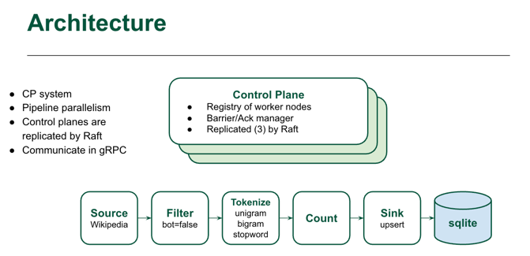

Wiki River is a distributed streaming system that processes real-time Wikipedia RecentChange events. 
The system ingests the live SSE stream, filters and tokenizes titles and comments, and performs word counting.
These workers—source, filter, tokenize, wcount, and sink—are coordinated by a three-node Raft controller cluster, 
which manages routing and ensures reliable delivery between stages. 
The final aggregated word counts are stored in SQLite for inspection and analysis.



# Installation

### Install protocol buffers
```
brew install protobuf
```

### Go plugins for protobuf and gRPC
```
go install google.golang.org/protobuf/cmd/protoc-gen-go@latest
go install google.golang.org/grpc/cmd/protoc-gen-go-grpc@latest
```

### Ensure $GOBIN is on your PATH:
```
export PATH="$(go env GOPATH)/bin:$PATH"
```

### Install Go dependencies
```
go mod tidy
```

### Generate all .pb.go files
```
make proto
```

# how to run

### Before running the system, reset the logs
```
rm -rf ./data/ctrl-1 ./data/ctrl-2 ./data/ctrl-3
```

### Controller 1 (bootstrap)
```
go run ./cmd/controller \
--addr=:7001 \
--node-id=ctrl-1 \
--raft-bind=127.0.0.1:9001 \
--raft-dir=./data/ctrl-1 \
--raft-bootstrap=true \
--http-addr=:7100
```

### Controller 2
```
go run ./cmd/controller \
--addr=:7002 \
--node-id=ctrl-2 \
--raft-bind=127.0.0.1:9002 \
--raft-dir=./data/ctrl-2 \
--raft-bootstrap=false \
--http-addr=:7106 \
--join=http://127.0.0.1:7100
```

### Controller 3
```
go run ./cmd/controller \
--addr=:7003 \
--node-id=ctrl-3 \
--raft-bind=127.0.0.1:9003 \
--raft-dir=./data/ctrl-3 \
--raft-bootstrap=false \
--http-addr=:7107 \
--join=http://127.0.0.1:7100
```

### Sink
```
ROLE=SINK go run ./cmd/sink --addr=:7105 --controller=127.0.0.1:7001 --db=results.db
```

### Count
```
ROLE=WCOUNT go run ./cmd/wcount   --addr=:7104 --controller=127.0.0.1:7001
```

### Tokenize
```
ROLE=TOKENIZE go run ./cmd/tokenize --addr=:7103 --controller=127.0.0.1:7001
```

### Filter
```
ROLE=FILTER go run ./cmd/filter --addr=:7102 --controller=127.0.0.1:7001
```

### Source
```
ROLE=SOURCE go run ./cmd/source \
--controller=127.0.0.1:7001 \
--sse-url=https://stream.wikimedia.org/v2/stream/recentchange
```

## Show Result
```
sqlite3 results.db
```

## Query
```
SELECT word, count
FROM word_counts
ORDER BY count DESC
LIMIT 20;
```
